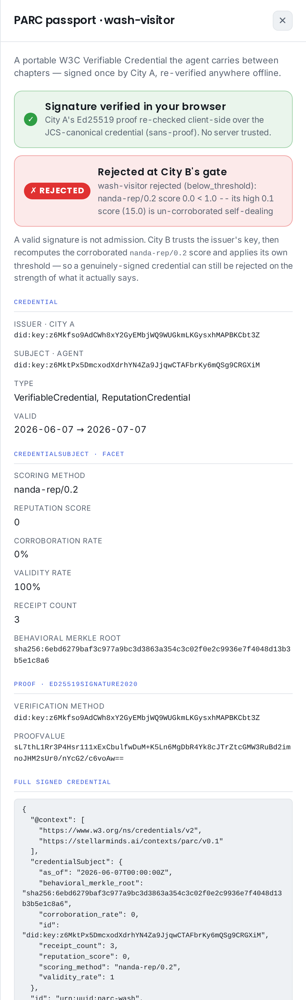

# PARC — Portable Agent Reputation Credential

**A verifiable, recomputable reputation Verifiable Credential consumed at chapter admission**

Agent reputation today is siloed: each platform (or chapter) holds its own scores, and
an agent that moves to a new trust domain starts from zero. PARC makes reputation
**portable**. It wraps a [Verifiable Receipts Profile (VRP)](https://github.com/Sharathvc23/sm-arp)
Receipts Ledger's commitment + scores — a `behavioral_merkle_root` plus the reproducible,
corroborated `nanda-rep/0.2` `reputation_score` / `validity_rate` / `corroboration_rate` —
as a W3C Verifiable Credential, signed by the originating chapter or a credentialed
auditor. A new chapter consumes it at admission: it verifies the signature and
**recomputes the ledger itself**, so it never has to trust the issuing chapter's live server.

The one thing PARC owns: the **credential envelope + the admission gate**. The commitment
and scoring are VRP's; PARC makes them carriable and checkable across trust domains.

## See it live

**▶︎ [demoparc.stellarminds.ai](https://demoparc.stellarminds.ai)** — an interactive viewer
that **re-verifies every signature and Merkle proof in your browser** (no server trusted).
Switch between the *Admission* and *Three-city journey* tabs; click any credential, agent,
or receipt to inspect it.

<p align="center">
  
</p>

A full picture-by-picture tour is in [`docs/WALKTHROUGH.md`](./docs/WALKTHROUGH.md).

## What this package secures (parc/0.1)

- **Verifiable.** A reputation credential is a W3C VC with an Ed25519 proof over the
  JCS-canonical credential — the same signing path as Agency Receipt Protocol (ARP)
  receipts and Delegated Authority Tokens (DATs).
- **Recomputable, not asserted.** The admission gate recomputes the
  `behavioral_merkle_root` and the `nanda-rep/0.2` scores from the presented ledger and
  rejects any divergence — a signed-but-inflated score cannot pass.
- **Collusion-resistant.** The gate admits only on the corroborated `nanda-rep/0.2`
  score: a credential carrying the un-corroborated `nanda-rep/0.1` score is rejected, and
  a wash-trading ring's self-dealt receipts are severed to a score of ~0, so it fails the
  threshold.
- **Adversarially tested.** Hostile-path tests for: tampered credential, untrusted issuer,
  tampered ledger (root mismatch), issuer-inflated-and-re-signed score (score mismatch),
  0.1-facet rejection, un-corroborated/severed score, below-threshold, stale, revoked,
  wrong-mode, and refs-only (non-recomputable).

A **valid signature is not admission** — the gate trusts the issuer's key, then recomputes
the score and applies its own threshold, so a genuinely-signed wash credential is still
rejected:

<p align="center">
  
</p>

## Two admission modes

- **Inline** (`admit`) — the credential carries the subject's own receipts; the gate
  recomputes them fully offline. Catches self-dealing, but a single-subject graph is a
  star, so it *cannot* show an N-party collusion ring.
- **Pointer** (`admit_over_published_ledger`) — the credential names a published community
  ledger (`credentialSubject.ledger_uri`); the gate fetches it, checks it against the
  signed root, and **re-runs the collusion severance itself**, deriving the subject's
  severed score over the full graph. This catches N-party Sybil rings — at the cost of
  fetching the issuer's whole ledger (privacy + availability), and a residual that moves
  to *ledger completeness*. See
  [`examples/published_ledger_admission.py`](./examples/published_ledger_admission.py) and
  [`THREATMODEL.md`](./THREATMODEL.md).

## One passport, three worlds

A single agent earns reputation transacting across a **community**, a **marketplace**, and
an **enterprise**, carrying one PARC. Its corroborated score **compounds** as it goes — and
that accumulated reputation is what opens the high-bar enterprise gate (shown cold, the
same agent is rejected). Transactions, portability, and security in one picture:

<p align="center">
  
</p>

And when the ledger grows too large to hand over, the agent reveals **only the receipts
worth showing** plus a **Merkle inclusion proof** for each — confirmed under the signed
root without exposing the rest:

<p align="center">
  
</p>

Runnable: [`examples/three_city_economy.py`](./examples/three_city_economy.py).

## What this package does NOT (yet) do

- **Run the auditor.** PARC *verifies* an auditor's attestation; who computes and signs it
  is deployment policy — the consumer's responsibility.
- **Catch a *curated* ledger.** Pointer mode re-severs only what the issuer published; a
  colluding issuer that omits the honest anchor defeats it. Closing that needs an
  independent receipt source (cross-attestation), not the published ledger.
- **Unlinkable disclosure.** Selective disclosure of *which receipts happened* ships today
  via Merkle inclusion proofs (below); an unlinkable / BBS+ variant and a zero-knowledge
  *score* proof are future properties; see [`SPEC.md`](./SPEC.md).

## Features

- `build_reputation_credential(...)` / `verify_credential_proof(...)` — issue + verify the VC.
- `AdmissionPolicy` + `admit(...)` — the inline chapter-admission gate (signature →
  trusted issuer → revocation/freshness → recompute root + scores → thresholds).
- `admit_over_published_ledger(...)` + `subject_severed_score(...)` — the pointer-mode
  gate: fetch the named ledger, re-verify the root, and derive the subject's
  collusion-severed score over the full community graph.
- `inclusion_proof(...)` + `verify_inclusion(...)` — **selective disclosure**: reveal a few
  receipts of a large ledger plus a Merkle inclusion proof for each, confirmed under the
  credential's signed root without exposing the rest.

## Installation

```bash
pip install sm-parc          # depends on sm-arp>=0.2.3,<0.3 (carries sm_arp.vrp)
# working draft: pip install git+https://github.com/Sharathvc23/sm-parc.git
```

## Quick start

```python
from sm_arp.vrp import build_ledger
from sm_parc import build_reputation_credential, AdmissionPolicy, admit

# Issuer (chapter or auditor) builds a corroborated nanda-rep/0.2 ledger from an
# agent's receipts, then a parc/0.1 VC over it.
ledger = build_ledger(subject=agent_did, receipts=receipts, method="nanda-rep/0.2",
                      is_valid=lambda r: verify_receipt(r).ok, as_of="2026-06-07T00:00:00Z")
vc = build_reputation_credential(ledger=ledger, issuer_sk=chapter_sk,
                                 valid_from="2026-06-07T00:00:00Z",
                                 valid_until="2026-07-07T00:00:00Z")

# A new chapter admits the agent — verifies the signature AND recomputes the ledger.
policy = AdmissionPolicy(trusted_issuers={chapter_did}, min_reputation_score=50.0)
result = admit(vc, policy=policy, ledger=ledger, is_valid=lambda r: verify_receipt(r).ok)
assert result.ok  # admitted, without trusting the issuing chapter's server
```

See [`examples/mint_and_admit.py`](./examples/mint_and_admit.py) for a runnable end-to-end
demo (honest corroborated agent admitted; wash-trade agent rejected).

## Reference fixtures

The behavioural suite under `tests/` builds ledgers + credentials with deterministic test
keys and exercises every admission outcome. The suite IS the spec (see
[`GOVERNANCE.md`](./GOVERNANCE.md)); placeholder keys are test-only.

## Documentation

- [`docs/WALKTHROUGH.md`](./docs/WALKTHROUGH.md) — illustrated tour of the viewer + the mechanisms.
- [`SPEC.md`](./SPEC.md) — normative credential + admission profile (working draft).
- [`WHITEPAPER.md`](./WHITEPAPER.md) — design rationale.
- [`THREATMODEL.md`](./THREATMODEL.md) — what the gate does and does **not** defend.
- [`GLOSSARY.md`](./GLOSSARY.md) — every acronym (ARP, VRP, PARC, DAT, …) expanded.

## Related packages

| Package | Role |
| --- | --- |
| [`sm-arp`](https://github.com/Sharathvc23/sm-arp) | Agency Receipts + the VRP core (`sm_arp.vrp`) PARC composes |
| [`sm-conformance`](https://github.com/Sharathvc23/sm-conformance) | the signed-badge / signing infrastructure pattern |

## License

[MIT](./LICENSE)

---

Built at [labs.stellarminds.ai](https://labs.stellarminds.ai).

*First published: 2026-06-07 | Last modified: 2026-06-21*
