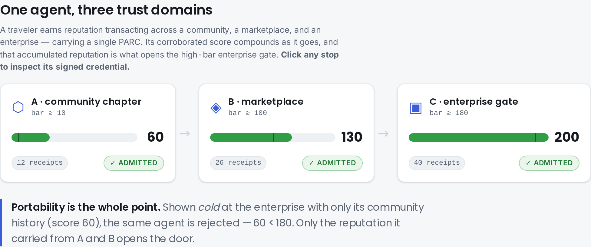
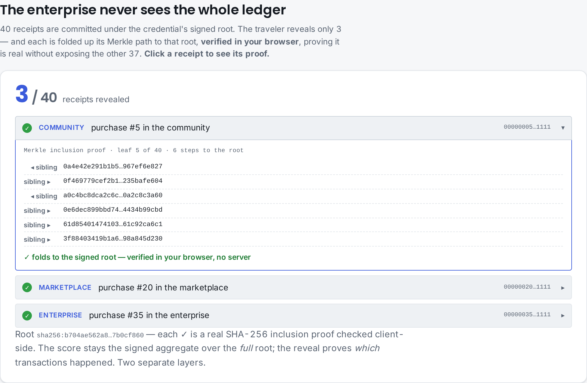

# PARC — Portable Agent Reputation Credential — Whitepaper

## Abstract

As autonomous agents act across organizational boundaries, the reputation they earn
is trapped in whichever platform minted it. An agent that moves to a new chapter,
marketplace, or trust domain starts from zero, and the receiving party has no way to
trust the old domain's score without trusting its server. PARC closes this gap: it
packages a Verifiable Receipts Profile (VRP) Receipts Ledger's commitment and
reproducible scores as a W3C Verifiable Credential, and defines an admission gate that verifies the credential by
recomputation. Reputation becomes a thing an agent carries, and a thing a stranger
can check.

## 1. Problem

Reputation is relational and earned, but it is recorded per-silo. Cross-domain
admission decisions therefore fall back on either blind trust of the origin server
or starting over. Neither is acceptable for a federated agent ecosystem: the first
re-centralizes trust, the second destroys the value of accumulated behaviour.

## 2. Design axioms

1. **Recompute, don't trust.** The admitting party recomputes the root and scores
   from the presented ledger; the credential's asserted values are a convenience, not
   evidence.
2. **One signing path.** The credential proof is Ed25519 over JCS — identical to
   Agency Receipt Protocol (ARP) receipts and Delegated Authority Tokens (DATs) — so
   the whole stack verifies signatures one way.
3. **Trust is policy.** A credential may be self-attested by a chapter or attested by
   an independent auditor; which is acceptable is the admitting party's policy.

## 3. The reputation-credential primitive

A ReputationCredential is the smallest envelope that makes a VRP facet portable: the
W3C VC carries the `behavioral_merkle_root` + corroborated `nanda-rep/0.2` scores + subject, signed
by an issuer the verifier can name. The admission gate is then a pure function —
credential + ledger + policy in, admit/reject out — whose core step is VRP
recomputation. The design follows from the axioms: because recomputation is
mandatory, a self-attested and an auditor-attested credential are equally safe, and
because the signing path is shared, no new crypto is introduced.

### 3.1 Two admission modes — a deliberate tradeoff

A credential is verified in one of two modes, and they are a tradeoff rather than a
ladder. In **inline** mode the credential carries the subject's own receipts and the
gate recomputes them fully offline — but a single subject's corroboration graph is a
star, never a strongly-connected component, so inline mode cannot detect an N-party
collusion ring. In **pointer** mode the credential instead names a published community
ledger; the verifier fetches it, checks it against the signed root, and **re-runs the
collusion severance itself**, deriving the subject's severed score over the full graph.
Pointer mode catches the ring — at the cost of fetching the issuer's whole ledger
(privacy and availability) and a residual that moves from *the issuer's score
computation* to *the issuer's ledger assembly*: a curated ledger that omits the honest
anchor is not severable and is admitted. Neither mode is strictly better; the verifier
chooses per its threat model. `THREATMODEL.md` states the boundary precisely.

## 4. Composition with the portfolio

```
  ARP (receipt)  ──►  VRP / sm_arp.vrp  ──►  PARC
  what an agent       behavioral_merkle_root   ReputationCredential (W3C VC)
  did, signed         + nanda-rep/0.2 + Ledger     + admission gate (recompute + verify)
                                               │
                          sm-conformance ──────┘  (Ed25519/JCS signing pattern)
```

## 5. Demonstration

A live, in-browser viewer ([demoparc.stellarminds.ai](https://demoparc.stellarminds.ai))
makes the axioms concrete — it re-verifies every signature and Merkle proof client-side,
trusting no server. A single agent earns reputation across three *different kinds* of trust
domain (community → marketplace → enterprise) and carries one PARC through all three:



The corroborated `nanda-rep/0.2` score **compounds** as the agent transacts (60 → 130 →
200) and is what opens the high-bar enterprise gate; shown cold, the same agent is
rejected. This is axiom 1 in action — admission is the verifier's *own* recomputation, not
the issuer's word.

As the ledger grows, the agent does not surrender it. It reveals only the receipts worth
showing, each with a Merkle inclusion proof against the credential's signed root:



This separates the two disclosures cleanly: the **score** is the signed aggregate over the
whole graph (severance needs every edge), while the **inclusion proofs** prove *which*
transactions happened — revealing honest receipts cannot launder a severed score. A
full illustrated tour is in [`docs/WALKTHROUGH.md`](./docs/WALKTHROUGH.md).

## 6. Open questions

- **Auditor runtime.** PARC verifies an auditor's attestation; standardizing who
  computes and signs it (and how an auditor is itself credentialed) is future work.
- **Revocation transport.** v0.1 takes a revocation set as policy input; a revocation
  list/endpoint format is a follow-up.
- **Selective disclosure.** Revealing *which transactions happened* ships now via
  Merkle inclusion proofs (`sm_parc.disclosure`): a holder discloses a subset of receipts,
  each proven under the credential's signed root, without exposing the rest. Open
  follow-ups are an *unlinkable* disclosure (BBS+) and a zero-knowledge proof of the
  *score* itself (so even the aggregate need not be taken on the issuer's signature) —
  built on open standards, independent of existing zero-knowledge-reputation art.
- **Ledger completeness (pointer mode).** Pointer-mode severance is only as honest as
  the published ledger: a colluding issuer that omits the honest anchor evades it, and
  the verifier — seeing only what was published — cannot tell. Closing this needs an
  independent receipt source (cross-attestation / a notary), not the ledger itself.

---

Built at [labs.stellarminds.ai](https://labs.stellarminds.ai).
