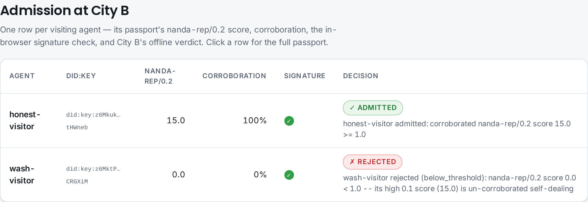
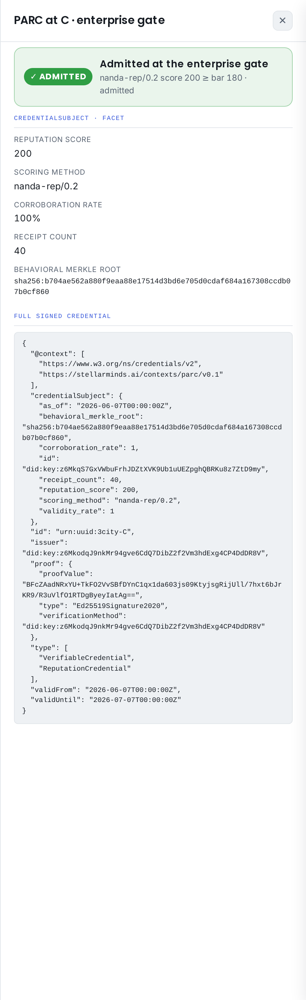

# PARC — an illustrated walkthrough

A picture-by-picture tour of what PARC does and how the live viewer proves it. Everything
below is re-verified **client-side** at [demoparc.stellarminds.ai](https://demoparc.stellarminds.ai) —
the browser checks every Ed25519 signature and every Merkle proof itself, trusting no server.

For the precise normative rules see [`SPEC.md`](../SPEC.md); for what the gate does **not**
defend, [`THREATMODEL.md`](../THREATMODEL.md); for acronyms, [`GLOSSARY.md`](../GLOSSARY.md).

## 1. The stack — each layer owns one job

```
ARP   (sm-arp)      signs the act      — Agency Receipt Protocol: one signed receipt
VRP   (sm_arp.vrp)  scores + severs    — Verifiable Receipts Profile: behavioral_merkle_root
                                          + corroborated, collusion-severed nanda-rep/0.2
PARC  (this repo)   ports + admits     — a signed W3C VC over a VRP facet + the admission gate
```

An agent acts; ARP makes each act a signed receipt. VRP commits those receipts to a
`behavioral_merkle_root` and scores them with corroboration + Tarjan-SCC collusion
severance. PARC wraps that commitment + score as a portable credential and defines the gate
a new chapter runs to admit or reject — **recomputing the ledger rather than trusting the
issuer's server**.

## 2. Admission — reputation that travels, collusion that can't

City A issues a PARC over each visiting agent's receipts. City B trusts A's `did:key` but
has **zero access to A's receipts store** — it decides from the credential alone, verifying
the signature and recomputing the `nanda-rep/0.2` score.



Both visitors carry an *identical* naive `nanda-rep/0.1` score. Only the corroborated
`0.2` score — which travels inside the PARC — tells them apart: the wash-trader's
self-co-signed history is severed to 0 and rejected, at a gate that never saw its history.

### Signature ≠ admission

Click any agent for its passport. The drawer makes the two checks explicit and *separate*:


The **signature is genuinely valid** (City A really did sign this credential) — so the
banner is green even for the wash-trader. But the **admission decision** is red: the
recomputed `nanda-rep/0.2` score is 0, below City B's threshold. A signed credential is not
an admitted one.

### Pointer mode — catching an N-party ring

An inline credential is single-subject: its corroboration graph is a *star*, never a
strongly-connected component, so it can never reveal a multi-party ring. **Pointer mode**
closes that gap — the credential names a published community ledger, and the verifier
fetches it and **re-runs the severance itself** over the full graph, deriving the subject's
severed score. The honest residual: it severs only what was *published* — a colluding
issuer that omits the honest anchor still gets in. (See
[`examples/published_ledger_admission.py`](../examples/published_ledger_admission.py) and the
*Admission* view's "When the gate fetches the ledger itself" section.)

## 3. One passport, three worlds

A single agent earns reputation transacting across three **different kinds** of trust
domain — community → marketplace → enterprise — carrying one PARC.


- **Transactions** — the ledger grows 12 → 26 → 40 receipts as the agent travels.
- **Portability** — the corroborated score **compounds** 60 → 130 → 200 and clears each
  domain's rising bar. Shown *cold* at the enterprise (community-only, score 60) the same
  agent is **rejected** (60 < 180) — accumulated reputation is the key.
- **Security** — a wash-trader is severed and rejected at the *lowest* bar of all.

Click any stop to inspect the signed PARC carried into that domain:



## 4. Selective disclosure — the enterprise never sees the whole ledger

A 40-receipt ledger should not be handed to every gate. The agent reveals **only the
receipts worth showing**, each with a **Merkle inclusion proof** against the credential's
signed `behavioral_merkle_root`. Click a receipt to fold it up its authentication path:


Each proof is real SHA-256, checked in the browser — *leaf → sibling → … → root* — and the
other 37 receipts are never exposed. The construction is identical to VRP's root (JCS
leaves sorted by `issued_at`/`receipt_id`; `SHA-256(left ‖ right)` nodes; odd node
duplicated), so the proof folds to exactly the root the credential signs over.

**The honest layer-split.** Severance needs the *whole* graph, so it cannot run on a
revealed subset. The two disclosures are therefore separate: the **score** is the signed
aggregate over the full root (proves *how reputable*); the **inclusion proofs** prove
*which transactions happened*. Revealing three honest receipts does **not** launder a
severed score — see [`SPEC.md`](../SPEC.md) §3.2 and [`THREATMODEL.md`](../THREATMODEL.md).

## 5. Run it yourself

```bash
pip install sm-parc
python examples/three_city_economy.py          # the A→B→C journey + selective disclosure
python examples/two_city_admission.py          # inline admission (honest vs wash)
python examples/published_ledger_admission.py  # pointer mode (N-party ring severance)
```

The interactive viewer shown above is live at
[demoparc.stellarminds.ai](https://demoparc.stellarminds.ai), re-verifying every signature
and Merkle proof in your browser.

---

Built at [labs.stellarminds.ai](https://labs.stellarminds.ai).
